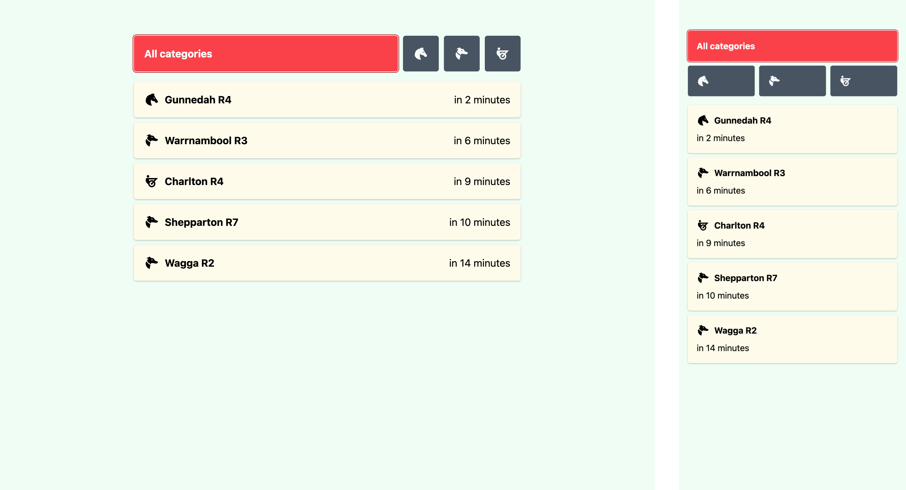
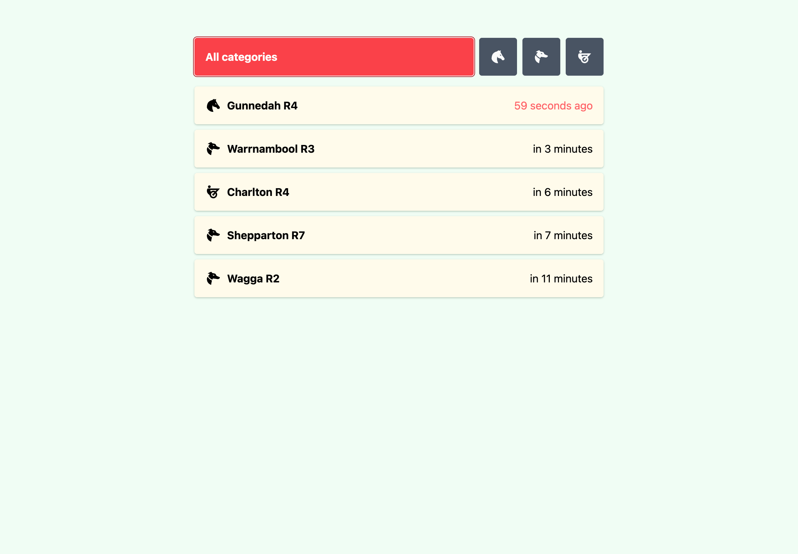
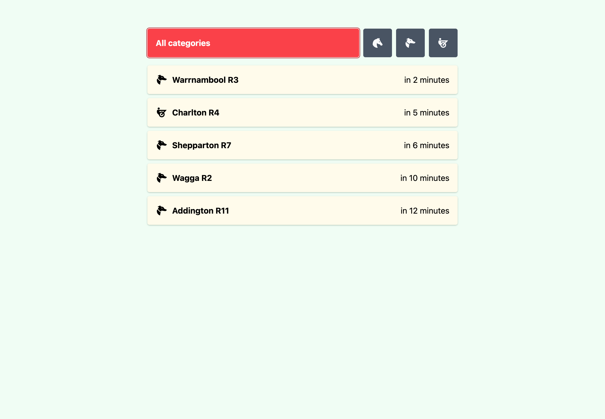
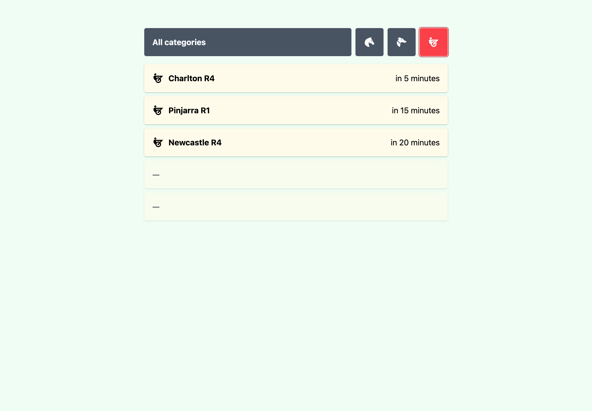
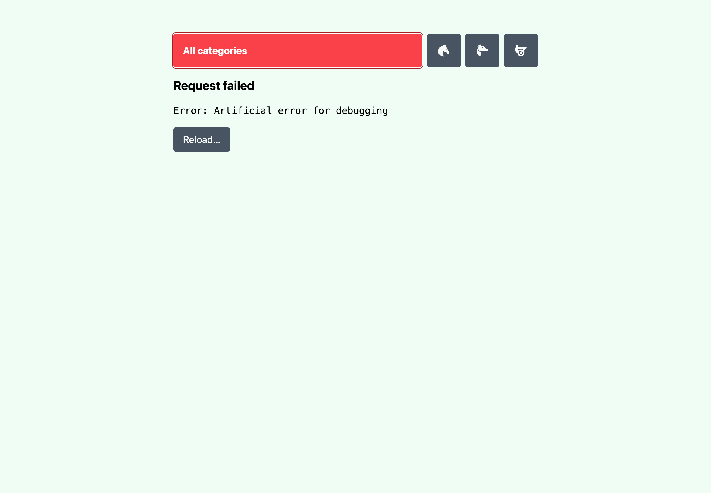

[Next to go (React)][react]
===========================

[react]: https://next-to-go.fly.dev/react/

- Bootstrapped with `bun init`.
- Journey: Start with React/Bun project for rapid prototyping &rarr; convert to
  Vite &rarr; apply Tailwind styles.
- Code, tests, and documentation was all written by a human (me). Absolutely no
  AI was used at any point.
- VS Code workspace extensions (recommended):
  - [ESLint][ext-eslint] (`dbaeumer.vscode-eslint`) -
    Linting and formatting on save.
  - [EditorConfig][ext-editorconfig] (`editorconfig.editorconfig`) -
    Consistent line endings and whitespace.
  - [Bun][ext-bun] (`oven.bun-vscode`) -
    Test runner and debugger.

[ext-eslint]: https://marketplace.visualstudio.com/items?itemName=dbaeumer.vscode-eslint
[ext-editorconfig]: https://marketplace.visualstudio.com/items?itemName=EditorConfig.EditorConfig
[ext-bun]: https://marketplace.visualstudio.com/items?itemName=oven.bun-vscode

Get started
-----------

```sh
# Build with Docker. Replace example host with real host.
docker build \
  --build-arg BUN_PUBLIC_API_HOST=https://api.example.com.au/ \
  --build-arg BUN_PUBLIC_ENABLE_MOCKS=0 \
  -t next-to-go-react .

# Run server on port 80.
docker run -p 80:80 next-to-go-react
```

Server will be available at <http://localhost/>.

Development
-----------

Requires `bun`.

```sh
# Install Bun.
curl -fsSL https://bun.sh/install | bash
```

```sh
# Start development server. HMR and mocks enabled.
bun dev

# Start production server. HMR and mocks disabled.
bun start

# Code style check. Will fix violations.
bun lint

# Execute unit tests.
bun test
bun test --watch

# Run build.
bun run build
```

Screenshots
-----------



| 59 seconds past jump    | 60 seconds past jump |
|-------------------------|----------------------|
|       |    |

| Category filtering      | Basic error handling |
|-------------------------|----------------------|
|  |    |

Criteria
--------

1. [x] **User should see 5 races at all times.** Uses overfetching to minimise
   the chance of less than 5 races at any time, however with category filtering
   it cannot be guaranteed that the backend returns at least 5 races in each
   category.
2. [x] **Races should be sorted by time ascending.** Sorting is not implemented
   on the frontend and instead deferred to the backend. This application trusts
   that result order is ensured by `next_to_go_ids`. Chronological sorting is
   trivial but intentionally omitted to reduce clientside performance overhead.
3. [x] **Race should disappear from the list after 1 min past the start time.**
   Races are filtered out of result set from API response according to category
   ID filtering and by comparing the race's jump time with the current system
   time. It is feasible that the user's system time is out of sync and this can
   result in undefined behaviour but handling this is out of scope.
4. [x] **User should see meeting name, race number and countdown timer that
   indicates the start of the race.** A global timer is used to ensure all
   countdowns are updated on the same render pass.
5. [x] **User should be able to toggle race categories to view races belonging
   to only the selected category.** These category IDs are hardcoded as constant
   values, however there is a potential area of improvement in deriving these
   from the backend to ensure separation of concerns and promote scalability.

Potential areas of improvement
------------------------------

This project is far from perfect. There are many potential areas of improvement.

1. **Replace hardcoded values with global configuration**. Ideally all configs
   are centralised and can be updated without searching for the module in which
   they are used in order to update them. It is best to use few or no
   deployments to change core functionality.
2. **Abstract and reuse styles**. Tailwind classes are inlined and can be moved
   into CSS modules or leverage other abstraction methods for simpler code and
   better reuse across components.
3. **Themeing and support for dark mode**. The current design is rigid in its
   implementation and beyond tweaking Tailwind vars to adjust colors and spacing
   etc there is no ability to apply wholesale style changes which is desirable.
4. **Better accessibility**. Semantic HTML elements are used as well as
   occasional ARIA tags but there is a lot of room for a more excessible
   experience particularly regarding keyboard-only use.

Other projects by me
--------------------

These other projects I have worked on may better demonstrate competency in some
key areas.

- [skeoh.com](https://skeoh.com/) - My portfolio written in NextJS which uses
  Tailwind and has a stronger focus on accessibility.
  - Code is unpublished.
- [wake.lol](https://wake.lol/) - A personal project of mine which has support
  for both dark mode and light mode as well as heavy use of global state
  management.
  - [Code published here](https://github.com/j-/wake.lol).
- [save-for-later](https://save-for-later.fly.dev/) - Unpublished project which
  uses Tanstack Query for querying/mutating data, IndexedDB for clientside data
  persistence, Tanstack Router for SPA routing, React Hook Form + Zod for forms,
  and FormatJS / React Intl for internationalisation / localisation. Also being
  developed as a PWA which supports the Share Target API (Chrome on Android
  only). Definitely a work in progress but something I'm excited about.
  - [Code published here](https://github.com/j-/save-for-later).
